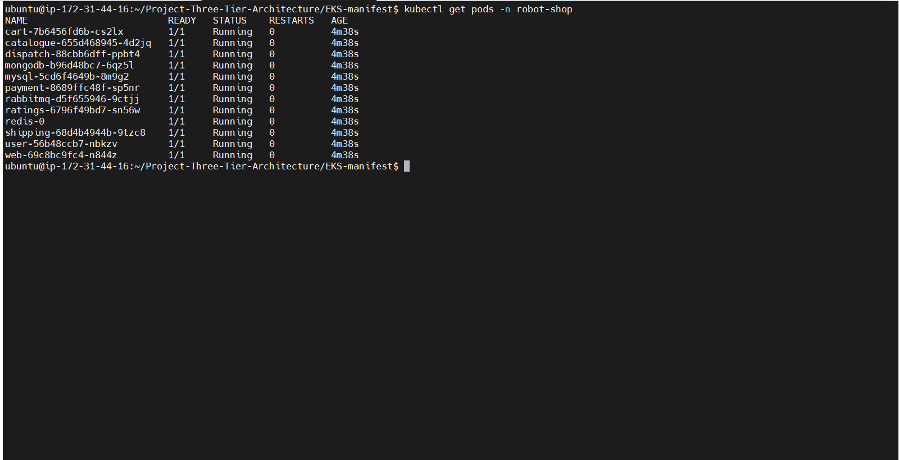
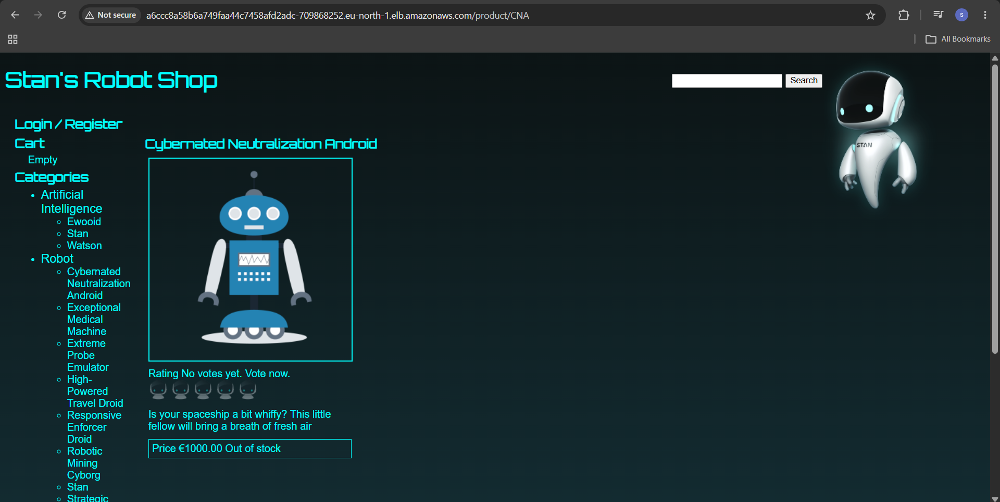

# Three Tier Architecture Deployment on AWS EKS
 
This guide walks you through deploying a 12-microservice application on AWS EKS using Helm charts.
 

## Prerequisites
 
- AWS Account
- EC2 Instance (Ubuntu) — used as management server
---
 
## Step 1 — IAM User Permissions
 
Create an IAM user and attach the following **inline policy**:
 
```json
{
  "Version": "2012-10-17",
  "Statement": [
    {
      "Effect": "Allow",
      "Action": [
        "eks:*",
        "ec2:*",
        "cloudformation:*",
        "iam:*",
        "ssm:GetParameter",
        "ecr:*"
      ],
      "Resource": "*"
    }
  ]
}
```

---
 
## Step 2 — Install kubectl
 
```bash
curl -LO "https://dl.k8s.io/release/$(curl -L -s https://dl.k8s.io/release/stable.txt)/bin/linux/amd64/kubectl"
sudo chmod +x kubectl
sudo mv kubectl /usr/local/bin
kubectl version --client
```
 
---
 
## Step 3 — Install AWS CLI
 
```bash
curl "https://awscli.amazonaws.com/awscli-exe-linux-x86_64.zip" -o "awscliv2.zip"
sudo apt install unzip -y
unzip awscliv2.zip
sudo ./aws/install --bin-dir /usr/local/bin --install-dir /usr/local/aws-cli --update
```
 
Configure AWS CLI with your credentials:
 
```bash
aws configure
```
 
Enter the following when prompted:
 
```
AWS Access Key ID [None]: <your-access-key>
AWS Secret Access Key [None]: <your-secret-access-key>
Default region name [None]: <your-region>
Default output format [None]:
```
 
Verify configuration:
 
```bash
aws sts get-caller-identity
```
 
---
 
## Step 4 — Install eksctl
 
```bash
ARCH=amd64
PLATFORM=$(uname -s)_$ARCH
 
curl -sLO "https://github.com/eksctl-io/eksctl/releases/latest/download/eksctl_$PLATFORM.tar.gz"
 
# Verify checksum (optional)
curl -sL "https://github.com/eksctl-io/eksctl/releases/latest/download/eksctl_checksums.txt" | grep $PLATFORM | sha256sum --check
 
tar -xzf eksctl_$PLATFORM.tar.gz -C /tmp && rm eksctl_$PLATFORM.tar.gz
 
sudo install -m 0755 /tmp/eksctl /usr/local/bin && rm /tmp/eksctl
 
eksctl version
```
 
---
 
## Step 5 — Install Docker
 
```bash
sudo apt update
sudo apt install -y docker.io
 
sudo usermod -aG docker $USER
newgrp docker
 
docker --version
```
 
---
 
## Step 6 — Install Helm
 
```bash
curl https://raw.githubusercontent.com/helm/helm/main/scripts/get-helm-3 | bash
helm version
```
 
---
 
## Step 7 — Create EKS Cluster
 
```bash
eksctl create cluster \
  --name robot-shop \
  --region eu-north-1 \
  --nodegroup-name robot-shop-ng \
  --node-type t3.small \
  --nodes 3 \
  --nodes-min 1 \
  --nodes-max 4 \
  --managed
```
 
> ⏱️ This takes **15-20 minutes**. Wait for it to complete.
 
Verify cluster and nodes:
 
```bash
kubectl get nodes
```
 
---
 
## Step 8 — Enable OIDC Provider
 
Required for IAM roles to work with Kubernetes service accounts:
 
```bash
eksctl utils associate-iam-oidc-provider \
  --region eu-north-1 \
  --cluster robot-shop \
  --approve
```
 
---
 
## Step 9 — Install EBS CSI Driver
 
EBS CSI driver is required for persistent storage (Redis).
 
### a. Create IAM Role
 
```bash
eksctl create iamserviceaccount \
  --name ebs-csi-controller-sa \
  --namespace kube-system \
  --cluster robot-shop \
  --region eu-north-1 \
  --attach-policy-arn arn:aws:iam::aws:policy/service-role/AmazonEBSCSIDriverPolicy \
  --approve \
  --role-name AmazonEKS_EBS_CSI_DriverRole
```
 
### b. Install CSI Driver Addon
 
```bash
eksctl create addon \
  --name aws-ebs-csi-driver \
  --cluster robot-shop \
  --region eu-north-1 \
  --force
```
 
### c. Verify Installation
 
```bash
kubectl get pods -n kube-system | grep ebs
```
 
Expected output:
 
```
ebs-csi-controller-xxx   6/6   Running   0   1m ✅
ebs-csi-node-xxx         3/3   Running   0   1m ✅
```
 
---

# Step 10 — Create ECR Repositories and Push Docker Images
 
## a. Create ECR Repositories using Terraform
 
All 11 ECR repositories are created automatically using Terraform.
 
```bash
# Go to Terraform folder:
cd Terraform
 
# Initialize Terraform:
terraform init
 
# Preview what will be created:
terraform plan
 
# Create all 11 ECR repositories:
terraform apply
```
 
> Type `yes` when prompted to confirm.
 
After apply completes you will see 11 ECR repositories created in AWS Console under **ECR → Repositories** 

## b. Build and Push Docker Images to ECR Repositories

Build all 11 Docker images using the Dockerfiles located in the `Dockerfiles/` folder, then push each image to its respective ECR repository.
 
---
 
## Step 11 — Deploy with Helm
 
```bash
# Create namespace:
kubectl create ns robot-shop
 
# Deploy all services:
helm install robot-shop \
  --namespace robot-shop \
  ./EKS-manifest/helm
```
 
---
 
## Step 12 — Verify Deployment
 
```bash
# Watch all pods starting:
kubectl get pods -n robot-shop -w
```
 
All pods should show `Running` and `1/1 Ready`:
 

 
---
 
## Step 13 — Access the Application
 
```bash
# Get LoadBalancer URL:
kubectl get svc web -n robot-shop
```
 
Copy the `EXTERNAL-IP` and open in browser:
 
```
http://<EXTERNAL-IP>
```

